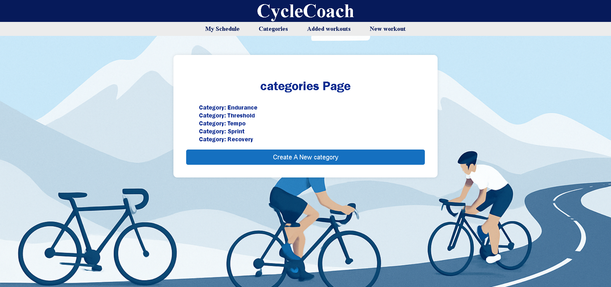

# CycleCoach


## Description
A platform for cyclist to create and manage categorized cycling workouts. Users browse and build custom workout schedules.


## Features
- Categorized workout browser (endurance, threshold, etc.)
- Workout detail view (title, duration, intensity)
- User cancreate/edit/delete workouts and categories
- User registration and login
- Add workouts to personal schedule

## 🎯 App Preview


## Architecture Diagram:
```
┌──────────────┐    ┌───────────────┐    ┌───────────────┐
│    User      │    │    category   │    │   workout     │
│              │    │               │    │               │
│ • name       │◄───│ • name        │◄───│ • title       │
│ • email      │    │ • description │    │ • duration    │
│ • password   │    │ • workouts[]  │    │ • description │
│ • workouts[] │    │               │    │ • itensity    │
│              │    │               │    │ • category    │
└──────────────┘    └───────────────┘    └───────────────┘
```

## File Structure:
```
CycleCoach/
├── app.js                  # Express app config
├── server.js               # Entry point (starts the server)
├── .env
├── .gitignore
│
├── models/
│   ├── user.js             # User model with JWT
│   ├── category.js         # Workout categories (like: endurance, threshold, sprints...)
│   ├── workout.js          # Workout model (linked to category)
│   └── db.js               # MongoDB connection setup
│
├── controllers/
│   ├── auth/
│   │   ├── dataController.js    # User auth logic (login, register)
│   │   ├── viewController.js    # View logic
│   │   └── routeController.js   # user routes
│   │
│   ├── workouts/
│   │    ├── dataController.js    # Workout logic
│   │    ├── viewController.js    # workout view logic
│   │    └── routeController.js   # Routes (/workouts)
│   │
│   └── categories/
│        ├── dataController.js    # category logic
│        ├── viewController.js    # category view logic
│        └── routeController.js   # Routes (/categories)
│
├── views/
│   ├── auth/               # Login/register pages
│   ├── workouts/           # Workout-related views (index, show, new)
│   ├── categories/         # Category views
│   └── layouts/            # Common layout files (e.g., main.jsx)
│
├── tests/                  # Jest test files
│   ├── auth.test.js
│
└── public/
    ├── BG.png   
    ├── styles2.css             
    └── styles.css
```

## Auth Routes
| Method | Endpoint | Description | Auth Required |
|--------|----------|-------------|---------------|
| POST | `/auth` | Create new user | No |
| GET | `	/auth` | 	Show signup form | No |
| POST | `	/auth/login` | Login user | No |
| GET | `/auth/login` | Show login form | No |
| PUT | `/auth/:id` | Update user | No |
| DELETE | `/auth/:id` | Delete user | Yes |
| GET | `/auth/schedule` | 	View user's workout schedule | Yes |
| GET | `/auth/schedule/workout/:id` | 	View specific workout in schedule | Yes |


## Category Routes
| Method | Endpoint | Description | Auth Required |
|--------|----------|-------------|---------------|
| GET | `/categories` | List all categories | Yes |
| GET | `/categories/new` | Create new category | Yes |
| GET | `/categories/:id` | View category & workouts | No |
| PUT | `/categories/:id/edit` | Edit category form | Yes |
| DELETE | `/categories/:id` | Delete category | Yes |

## Workout Routes
| Method | Endpoint | Description | Auth Required |
|--------|----------|-------------|---------------|
| GET | `	/workouts` | List all workouts | Yes |
| GET | `/workouts/:id` | View workout details | Yes |
| POST | `/workouts/new` | Create new workout | Yes |
| PUT | `/workouts/:id/edit` | Edit workout | Yes |
| DELETE | `/workouts/:id` | 	Delete workout | Yes |
